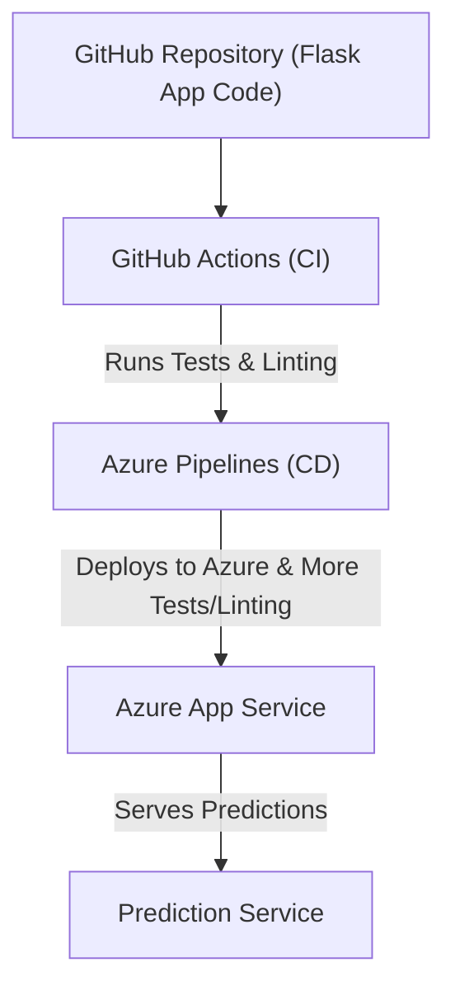

# Project Overview

Build a CI/CD pipeline to automate the deployment of a machine learning microservice API using Flask. Set up a GitHub repository with structured scaffolding, incorporating a Makefile, requirements.txt, and application code. Use GitHub Actions for Continuous Integration by running linting, testing, and installation workflows. Integrate Azure Pipelines for Continuous Delivery to deploy the Flask app to Azure App Services. Demonstrate DevOps and ML engineering skills with a final demo showcasing the operationalization of machine learning models in a cloud environment.


## Project Plans

The project plan is structured into milestones, covering Flask API development, ML model integration, CI/CD implementation, testing, and deployment. 

- The [trello board](https://trello.com/b/yB1P1XJD/buildcicdpipeline) track tasks in 3 categories: To Do, In Progress and Done.
- The [spreadsheet](https://docs.google.com/spreadsheets/d/1U11YbFkv5H8b5wT21PZTcDiYmlsPfOksCUsgEl4DDH0/edit?usp=sharing) timeline outlines key deadlines and responsibilities.


This ensures efficient progress, clear accountability, and a smooth deployment to Azure.

### Project architecture



### Azure Cloud Shell Setup

1. Launch Azure Cloud shell env and create ssh-keys. Upload these keys to Github account. [ref](https://www.youtube.com/watch?v=Z8uRw6N5TGY&t=84s)

```bash
ssh-keygen -t rsa
cat /home/shekhar/.ssh/id_rsa.pub
```

2. Clone the repo to Azure (use SSH)
  
  

3. Project cloned into Azure Cloud shell


4. Create makefile, requirements.txt in the Github repo.

5. Create Python virtual environment 


```bash
python3 -m venv ~/.Build_CI_CD_pipeline
source ~/.Build_CI_CD_pipeline/bin/activate
```

6. Run make all


7. All the test cases should pass


###  Configure GitHub Actions

Configure GitHub Actions to test your project upon change events in GitHub. Ensure continuous integration (CI) is performed remotely by setting up automated tests whenever code is checked into a Git-based repository. Set up both a SaaS build service and the necessary configuration files to define the build process. Use GitHub Actions as the CI service to automate testing and validation.

DevOps best practices by integrating GitHub Actions into your project. 
This step finalizes the CI process, preparing the project for the next phase: Continuous Delivery.
A push event to GitHub triggers a GitHub Actions container, which executes a series of predefined commands.


1. Enable GitHub Actions in the GitHub UI.  [ref](https://www.youtube.com/watch?v=U29oRwnkASw&t=16s)
2. Add the pythonapp.yml in the GitHub Actions workflow.
3. Verify remote tests pass in GitHub Actions UI


4. The GitHub Actions build passed.


### CD on Azure

This is the final step that invloves setting up Azure Pipelines to deploy the Flask application on Azure App Services.
(This case, Azure Pipelines are used to deploy CD, which can be done with GitHub Actions as well.)

Enable source control integration, select the Azure Pipelines to build provider, and finally configure the App Services permissions.


1. Get the starter [code](https://github.com/udacity/nd082-Azure-Cloud-DevOps-Starter-Code/tree/master/C2-AgileDevelopmentwithAzure/project/starter_files) and add to the repo. Git clone and put the **flask-sklearn** folder inside the main branch.
2. When launching Azure Pipelines, creating a resource group is an important step. 
It helps organize and manage all the resources required for the pipeline.
Create a resource group (in case, you still have tag-policy, please do not forget to add tags).

```bash
az group create -l northeurope -n "cicd-rg"
```


3. Before proceeding, ensure that you are in the **Azure Cloud Shell**, located in the correct **project directory** (this case flask-sklearn), and also make sure, you've **activated Python** using the `source` command.

Now, create the web app. To do so, run the following command: (it takes sometime)
Azure 1st checks if that webapp exists, if not, it creates it.
(the name can be anything, here it is **house-price-pred-app**)

[Location codes](https://gist.github.com/ausfestivus/04e55c7d80229069bf3bc75870630ec8)

```bash
az webapp up --runtime PYTHON:3.9 --sku F1 --logs --location northeurope --name house-price-pred --resource-group "cicd-rg" 
```


Please go to Azure portal (GUI) and search for **house-price-pred**:


Check if the UI is running:


4. **Prediction is 2.43** (not 20.xxx)


5. Check log file
   
```bash
https://house-price-pred.scm.azurewebsites.net/api/logs/docker
```


6. Build PAT token so that we can authenticate Azure DevOps services with VM on Azure. 


[ref](https://www.youtube.com/watch?v=jzX2fOaf67w&t=136s)

(A VM created on Azure can connect to Azure DevOps Agent Pool by help of PAT)

Please note that you can also Microsoft-hosted agents. (That case PAT and VM are not necessary)
Below it shows when you need self-hosted agents.


7. While running Azure pipeline for the 1st time, you might encounter this error:


Please fill up the form and request for approval from MS:


**This is the reason you need to set up self-hosted agents.**

8. Create Self-Hosted Agent(VM), Configure the agent (VM), Install Agent services, Verify myAgentPool has the agent (VM) Online.
So the agent has been successfully registered in this myAgentPool


9. Simple run of Azure Pipelines (job is successful)


10.  Deployed webapp **house-price-pred** to Azure via Azure pipeline ( chose **master branch** for the same)


(During deployment of webapp, the Azure devops pipeline will ask for Permission)


## Enhancements

1. Modify the Flask App to have new endpoints ( adding postal code, type of house etc.)
2. Use different ML tasks to 

## Demo 

[youtube](https://youtu.be/BBx5CQ4mvWs)
